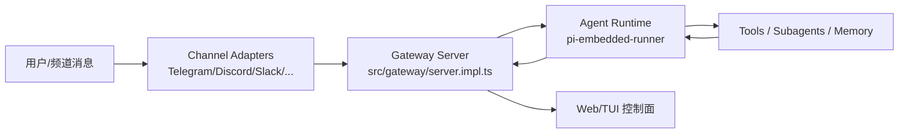
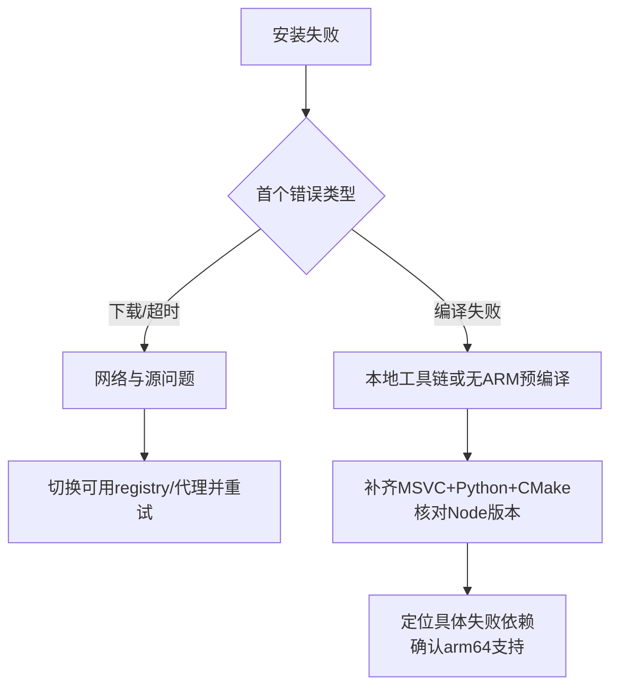

# OpenClaw 架构说明（当前实现）

本文基于当前代码实现，说明 OpenClaw 的核心架构、执行链路与常见行为。

## 1) 总体架构

- Channel 适配层负责把外部消息转换成统一事件。
- Gateway 负责会话路由、状态广播、运行时编排。
- Agent Runtime 负责模型调用、上下文维护、重试/降级策略。
- Tools 层包含工具调用、subagent、memory 搜索。

## 2) Agent loop 在哪里实现？是否有 RL 式反馈？

核心在 `src/agents/pi-embedded-runner/run.ts`：
- 运行循环由嵌入式 runner 驱动，处理模型请求、工具调用、流式输出、异常重试。
- 会结合 `runs.ts` 维护 active run、abort/wait 等运行控制。
- 会处理上下文超限（压缩/裁剪）和 profile failover（可用凭据切换）。

是否有 RL（强化学习）式在线反馈闭环：
- 当前实现没有在线 RL 训练回路（没有把每次交互作为 reward 直接反向训练模型权重）。
- 当前的“反馈”更偏工程策略：重试、失败回退、模型/凭据切换、上下文整理，而非参数学习。

## 3) Gateway 做什么？会影响模型“思考”吗？

Gateway 主体在 `src/gateway/server.impl.ts`，聊天状态/广播在 `src/gateway/server-chat.ts`。

Gateway 主要职责：
- 管理连接、会话与频道事件。
- 把请求交给 runtime，并把状态/输出分发给 UI 或调用方。
- 统一鉴权、生命周期、状态探测和可观测性入口。

对模型“思考”的影响边界：
- **直接**不改变模型权重或推理算法。
- **间接**会影响推理条件（例如默认模型、上下文长度、路由到哪个 provider、是否启用某些工具）。

## 4) Subagent 是怎么管理的？为什么会被 kill？

关键代码：
- `src/agents/tools/sessions-spawn-tool.ts`：创建/启动 subagent。
- `src/agents/subagent-registry.ts`：注册、生命周期监听、清理与归档。

典型生命周期：
1. 父 agent 通过 tool 请求 spawn。
2. registry 记录实例与会话关系。
3. subagent 运行并回传结果/状态。
4. 正常完成或异常后进入清理（detach/terminate/archive）。

常见被 kill 的原因：
- 父任务取消或超时（abort 信号传播）。
- 会话结束触发回收。
- 异常崩溃后被 registry 清理。
- 资源保护策略触发（并发/生命周期上限）。

## 5) 去掉 node-llama 后，memory search 默认怎么走？

核心逻辑在 `src/agents/memory-search.ts`（及相关 embedding/provider 选择路径）。

当前行为可概括为：
- memory search 先按配置选择可用 embedding/provider。
- 如果 `node-llama` 不可用，不会走 llama 本地 embedding 路径。
- 会回退到配置中仍可用的 provider（例如其他远程 embedding 或可替代实现）；若无可用 provider，则该类检索能力受限并按错误/降级路径处理。

也就是说：移除 `node-llama` 不是“整个 memory 系统必然失效”，而是失去对应本地后端，最终效果取决于剩余 provider 配置。

## 6) Azure AI Foundry 接入（本次实现）

本次已在 onboarding 链路加入 Azure Foundry（endpoint/deployment/model/secret）支持：
- 新增 auth choice：`azure-foundry-api-key`
- 新增 CLI 参数：
  - `--azure-foundry-api-key`
  - `--azure-foundry-endpoint`
  - `--azure-foundry-deployment`
  - `--azure-foundry-model`
- 交互与非交互 onboarding 均可落盘到 `models.providers["azure-foundry"]`，并设置默认 model ref。

## 7) ARM Windows 安装失败：依赖问题 vs 中国网络因素

### 7.1 依赖/平台因素（高概率）
- 某些原生依赖在 Windows ARM64 没有现成预编译包，安装时触发本地编译并失败。
- Node 版本、MSVC Build Tools、Python/CMake 组合不匹配，会放大失败率。
- 依赖树中间接引入 x64-only 二进制也会导致安装失败。

### 7.2 中国网络因素（同样常见）
- npm/GitHub Release/CDN 拉取超时或被限速，导致包下载不完整。
- 可选二进制下载失败后 fallback 到源码编译，进一步暴露本地工具链问题。

### 7.3 排查顺序建议
1. 先看首个真实报错（不要只看最后一行）。
2. 区分“下载失败”还是“编译失败”。
3. 锁定失败包后确认是否有 arm64 预编译产物。
4. 校验 Node 版本与工具链（MSVC/Python/CMake）。
5. 在网络受限环境下优先验证 registry 镜像与代理策略。

